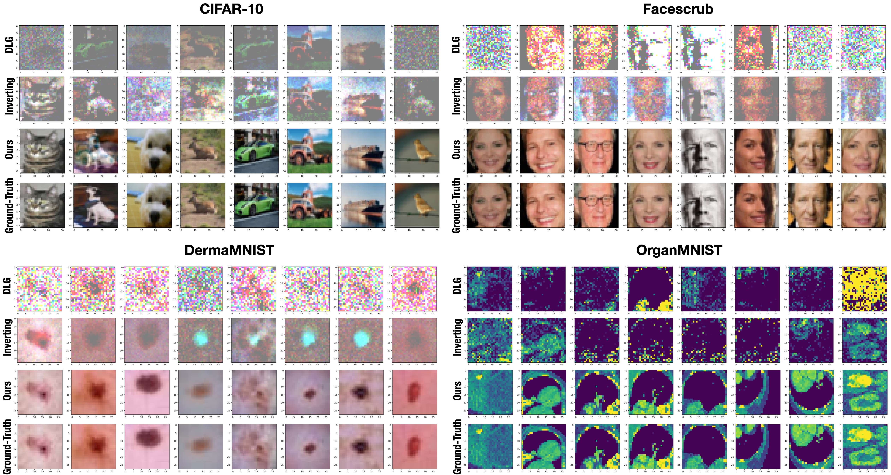
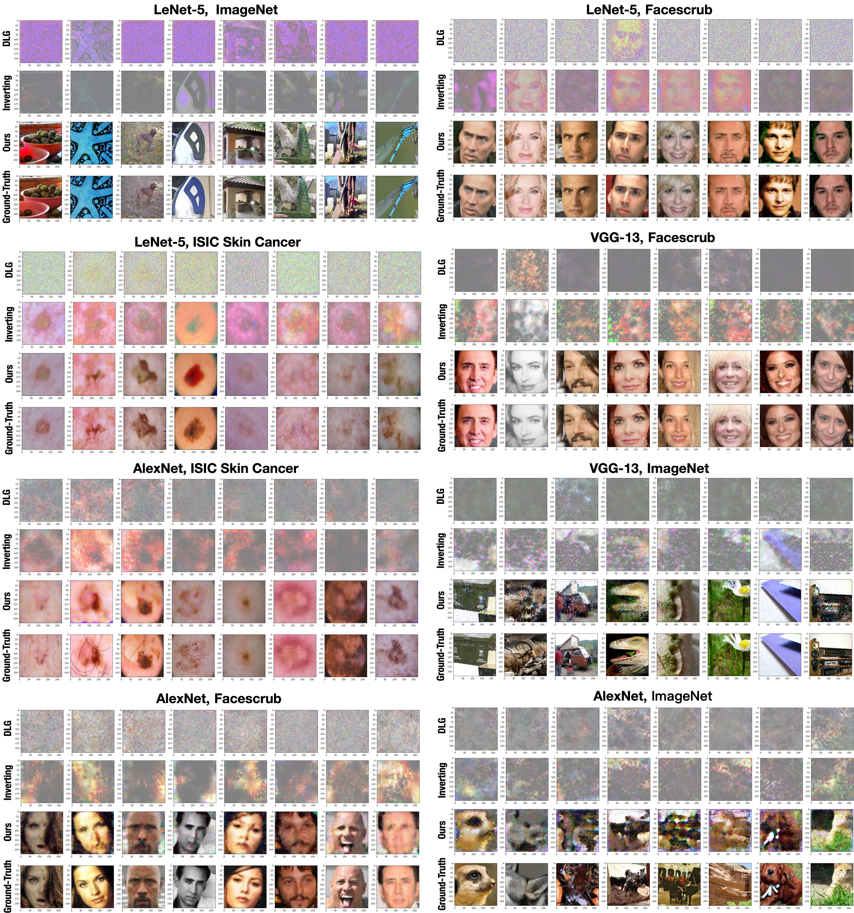
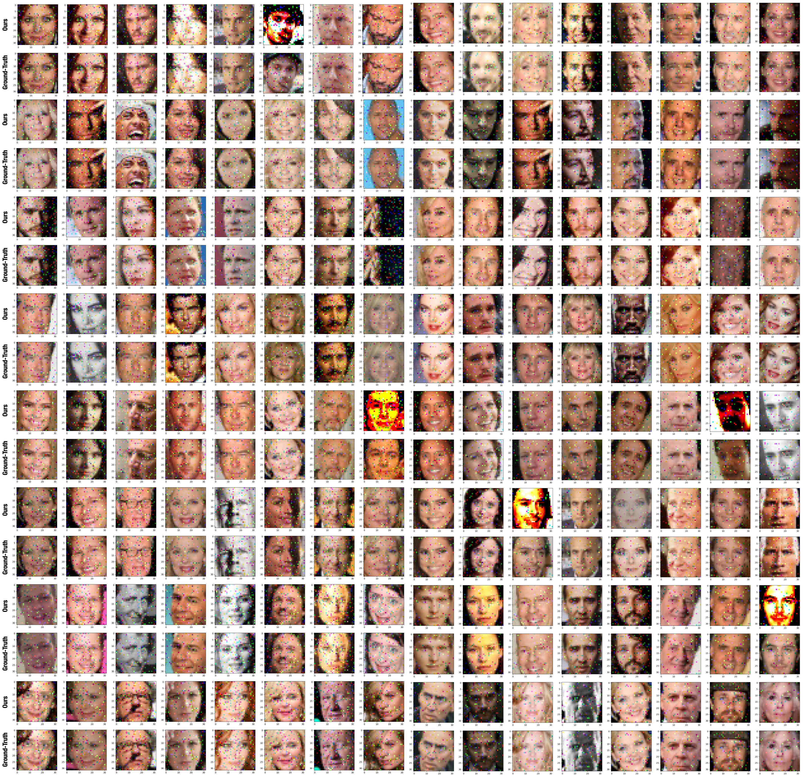

# USENIX22-ExAN
### Omitted Proofs
Omitted Technique Proofs for USENIX Security'22 Paper "Exploring the Security Boundary of Data Reconstruction via Neuron Exclusivity Analysis" can be found in [Technical Proofs](proofs.pdf).

### Visualization of Attack Performance
1. Omitted visualization results accompanying Fig. 6 in the main text.

2. Omitted visualization results accompanying Fig. 8 in the main text.

3. Visualization of a reconstructed batch of $128$ samples from Facescrub, where the ground-truth images are slightly perturbed to satisfy the condition of sufficient exclusivity.

### Copyright Claim
ALL COPYRIGHTS PERTAINING TO THIS MATERIAL BELONG TO THE AUTHORS. DO NOT USE IT FOR ANY COMMERCIAL PURPOSES OR DESEMINATE WITHOUT THE AUTHORS’ PERMISSION. 

